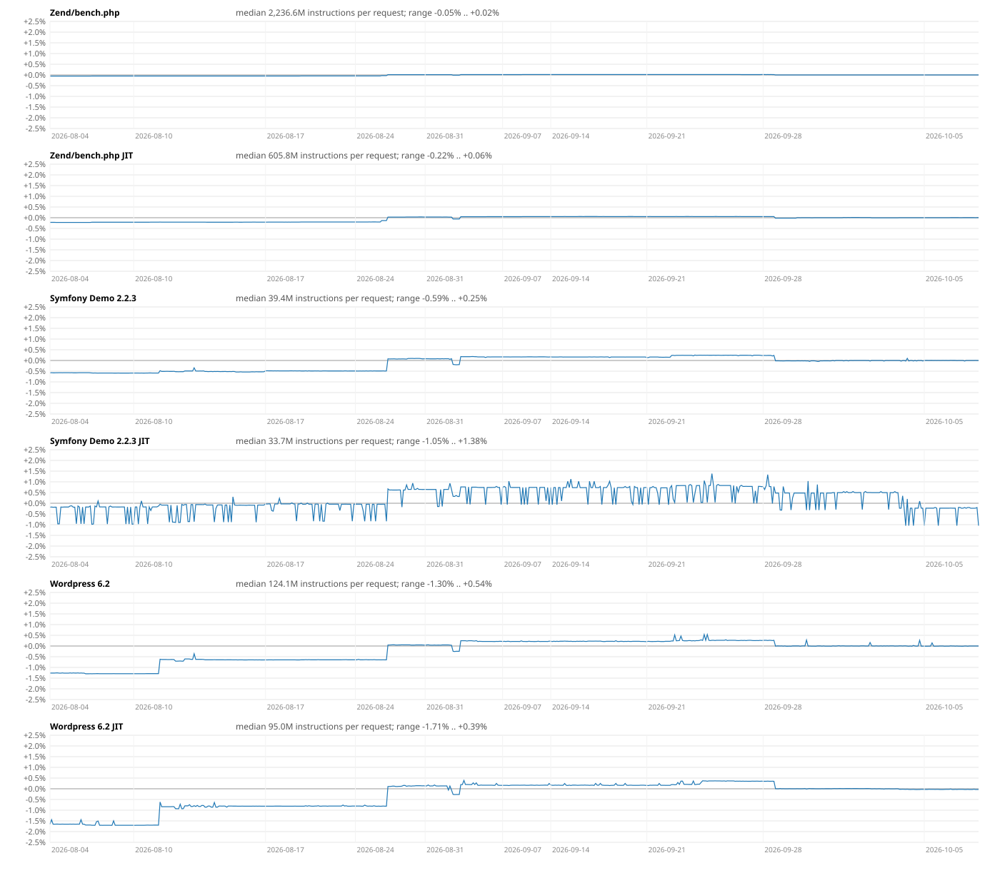
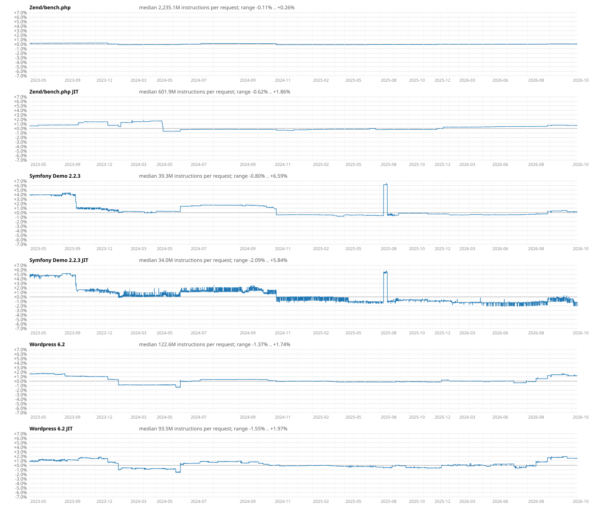

# php-src's benchmark CI, read as a history

php-src runs a benchmark job on every push and pull request: `Zend/bench.php`, Symfony Demo
2.2.3 and WordPress 6.2, each with and without the JIT, under callgrind, one instruction count
per workload. On pushes the numbers are committed to
[php/benchmarking-data](https://github.com/php/benchmarking-data); on pull requests a diff
against the base is written to the job's step summary. There is no chart, no history view and
no notion of what counts as noise, so the numbers are consulted by authors of performance PRs
on their own PRs and by nobody else. This is what the data looks like when it is plotted.

Made on 2026-10-08 from 7,024 master commits with results (May 2023 – October 2026), ordered by
`git log --first-parent`. `bench_history.py N [Y]` draws the last N commits on a ±Y% scale around
each series' median; it expects a clone of `benchmarking-data` in `bdata/`.

## Two months

Same scale on every panel, ±2.5% around the median. What it shows:

- **The non-JIT series are nearly noise-free.** Between consecutive commits the median |Δ| is
  0.001%, the 90th percentile 0.035%. A 0.1% step on Symfony or WordPress without JIT is a
  signal, not noise — a far finer threshold than the 1% people tend to assume.
- **Symfony Demo with JIT is bimodal**: two levels about 1% apart, switching at random between
  commits, for the whole history. The other JIT series are quiet. Whatever makes the tracing JIT
  compile a different set of traces from run to run makes that series useless below 2%.
- **Steps that move every series together are usually the allocator**: `zend_alloc` is the
  one thing all three workloads share. Sanity-checking huge block sizes (2026-09-03, −0.27%),
  binding free-list shadow pointers (2026-09-04, +0.4–0.5%), `uint32_t` bin numbers
  (2026-09-28, −0.3%). One shared step is not PHP at all: a commit touching only `sapi/phpdbg`
  (2026-08-27) "moved" everything by +0.6–1.5%, which is the runner image changing underneath.

## The whole history

±7% around the median. Over three and a half years the applications got 1–3% cheaper in
instructions per request; `bench.php` stayed within a 0.4% band. The steps larger than 0.5%
on the non-JIT application series:

| date | commit | Symfony | WordPress | what |
|---|---|---|---|---|
| 2023-10-14 | `d0b29d8286` | −1.48% | — | Optimize `strspn()` |
| 2023-10-16 | `1e2e2f391c` | −0.98% | — | ext/pcre refactoring |
| 2024-02-06 | `631bc81607` | −0.53% | −1.15% | stackless internal function calls |
| 2024-06-12 | `25360ef249` | +1.17% | +1.56% | Detect heap freelist corruption |
| 2024-11-07 | `fb257ee83c` | −1.32% | −0.19% | runner upgraded to Ubuntu 24.04 — environment |
| 2025-08-08 | `922c225fbf` | +6.89% | — | Deprecate `Reflection*::setAccessible()` |
| 2025-08-14 | `fb87b14b6c` | −6.12% | — | not PHP: the benchmark app got a commit that day, "Disable Symfony's error handler to avoid slowdowns due to new deprecations" |
| 2026-08-10 | `e95647ce36` | — | +0.68% | Deprecate ArrayIterator methods |
| 2026-08-27 | `9d6fd4fd98` | +0.57% | +0.70% | phpdbg-only commit — environment |
| 2026-09-04 | `946c799de4` | +0.38% | +0.49% | zend_alloc: bind free list shadow pointers |

Two things in this table nobody discussed at the time, because nobody was looking at the
history:

1. **Hardening has a price.** The freelist corruption check cost the applications 1.2–1.6% in
   2024, the shadow pointers 0.4–0.5% in 2026. Both may well be worth it; neither was measured.
2. **Deprecations in a hot path are expensive.** One deprecated `setAccessible()` call per
   request made Symfony Demo 6.9% more expensive. The reaction was to disable the error handler
   in the benchmark's copy of the application, which hid the cost from the benchmark but not from
   applications — every Symfony and Laravel application runs with an error handler. That is what
   led to measuring what a single deprecated call costs:
   [deprecation-cost](../deprecation-cost/): about 5,000 instructions when the deprecation is
   declared with `#[\Deprecated]`, 2,150 otherwise, and filtering `E_DEPRECATED` out of
   `error_reporting` saves none of it.

## What a dashboard over this data should do

- One scale for all panels, percent of the series' median; a per-panel autoscale turns a 0.1%
  band into the same picture as a 2.5% one.
- Every step annotated with the commit's subject and diffstat; a commit outside `Zend/`,
  `ext/` and `main/` that moves every series is the environment.
- Steps that coincide with commits to the benchmark application repositories or to
  `.github/workflows` and `benchmark/` flagged as changes of the bench, not of PHP.
- JIT series shown with their two modes, or as a window minimum.
- For PR diffs, a significance threshold taken from the data (~0.1% on the non-JIT series),
  with the JIT noise stated.
